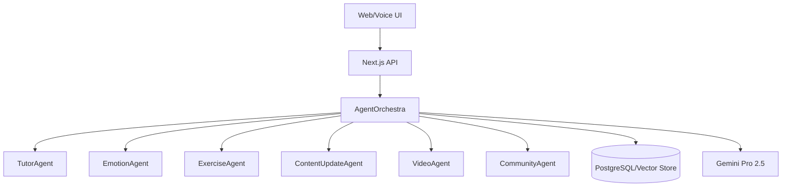

# 🛠️ ProfAI – Technical Documentation

**Version:** 1.0  
**Date:** August 2025  
**Project:** Voice-Driven AI Professor with Emotional Intelligence

---

## 1. System Architecture Overview

ProfAI is built as a modular, multi-agent system designed for adaptive, emotionally-aware AI education. The architecture is composed of several logical layers and specialized agents, orchestrated to deliver a seamless, personalized learning experience.

### 1.1 Logical Layers

- **Interaction Layer:** Next.js web frontend, chat and voice UI, API endpoints
- **Orchestration Layer:** AgentOrchestra (workflow coordinator), scheduler, policy engine
- **Agent Layer:**
  - TutorAgent (lesson planning, explanations)
  - EmotionAgent (emotion detection, intervention)
  - ExerciseAgent (exercise generation/evaluation)
  - ContentUpdateAgent (content refresh, trend scanning)
  - VideoAgent (tutorial generation)
  - CommunityAgent (community integration)
- **Data Layer:** PostgreSQL (Prisma ORM), user profiles, progress, vector store for embeddings, lesson metadata
- **Model Layer:** Google Gemini Pro 2.5 (LLM), lightweight sentiment models, text embeddings

### 1.2 Component Diagram

---

## 2. Technology Stack

- **Frontend:** Next.js 14 (TypeScript), Tailwind CSS, Radix UI, React Query, Framer Motion
- **Backend:** Next.js API Routes, NextAuth.js, Prisma ORM, SQLite/PostgreSQL
- **AI/ML:** Google Gemini Pro 2.5, @google/generative-ai, custom emotion/sentiment models
- **Voice/Audio:** Speech-to-text, text-to-speech APIs (e.g., ElevenLabs, Google)
- **Video:** Puppeteer (screen capture), FFmpeg (editing), Shiki (code highlighting)
- **Community:** Hack-Nation integration, Replit API, GitHub Codespaces
- **DevOps:** Docker, Vercel/Cloud hosting, CDN, CI/CD pipelines

---

## 3. Main Agents and Responsibilities

### 3.1 TutorAgent

- Generates lessons, explanations, and adapts content to user profile and emotional state
- Supports multiple learning styles (visual, auditory, kinesthetic)
- Interfaces with LLM for content generation

### 3.2 EmotionAgent

- Analyzes user input for emotional cues (frustration, confusion, engagement)
- Triggers interventions (simplify, encourage, pause, challenge)
- Tracks emotional patterns for adaptive learning

### 3.3 ExerciseAgent

- Generates coding exercises and quizzes based on lesson context
- Evaluates submissions, provides feedback, and adapts difficulty
- Supports multiple programming languages

### 3.4 ContentUpdateAgent

- Monitors external sources for AI news and tool updates
- Auto-generates new lessons or updates existing content
- Prioritizes updates based on relevance and urgency

### 3.5 VideoAgent

- Generates step-by-step video tutorials with code and narration
- Uses screen capture, code highlighting, and voice overlay

### 3.6 CommunityAgent

- Integrates with Hack-Nation channels for sharing achievements and discussions
- Automates posting of significant milestones

---

## 4. Data Model (Prisma Schema)

- **User:** Profile, learning style, skill level, emotion baseline, progress, voice profile
- **Course:** Title, description, category, difficulty, lessons
- **Lesson:** Content, objectives, prerequisites, exercises, metadata
- **Exercise:** Type, difficulty, requirements, evaluation, feedback
- **Session:** User progress, emotional state, timestamps
- **Evaluation:** Submission, score, feedback, attempt history

---

## 5. Key Workflows

### 5.1 Learning Session

1. User initiates session (text/voice)
2. EmotionAgent analyzes input
3. TutorAgent generates/adapts lesson
4. ExerciseAgent provides practice
5. EmotionAgent monitors and intervenes as needed
6. Progress and emotional data stored

### 5.2 Exercise Evaluation

1. User submits solution
2. ExerciseAgent evaluates and scores
3. EmotionAgent checks for frustration
4. If needed, intervention triggered (simplify, encourage, pause)
5. Feedback and next steps provided

### 5.3 Content Update

1. ContentUpdateAgent scans sources
2. New trends/topics identified
3. Lessons auto-generated or updated
4. Users notified of new content

### 5.4 Emotional Intervention

1. Negative emotion detected (e.g., frustration)
2. EmotionAgent recommends intervention
3. TutorAgent reformulates content or suggests break
4. Action plan and next steps generated

---

## 6. Security & Scalability Considerations

- **Authentication:** NextAuth.js with OAuth and optional 2FA
- **Data Protection:** Encrypted storage, GDPR compliance, secure backups
- **API Security:** Input validation, rate limiting, XSS/SQLi protection
- **Scalability:** Horizontal scaling, CDN, stateless API, optimized DB queries
- **Testing:** Unit, integration, E2E, and performance tests (80%+ coverage)

---

## 7. Deployment & DevOps

- **CI/CD:** Automated build, test, and deploy pipelines
- **Hosting:** Vercel/Cloud, Docker containers
- **Monitoring:** Logging, error tracking, performance metrics
- **Backup:** Automated daily DB backups, point-in-time recovery

---

## 8. Future Enhancements

- Multi-modal input (image, document analysis)
- Native mobile apps (iOS/Android)
- Gamification and achievement systems
- Instructor dashboards and analytics
- Advanced research mode for academic users

---

**Document prepared by:** ProfAI Engineering Team  
**Review Date:** August 2025  
**Status:** For Internal Use Only
